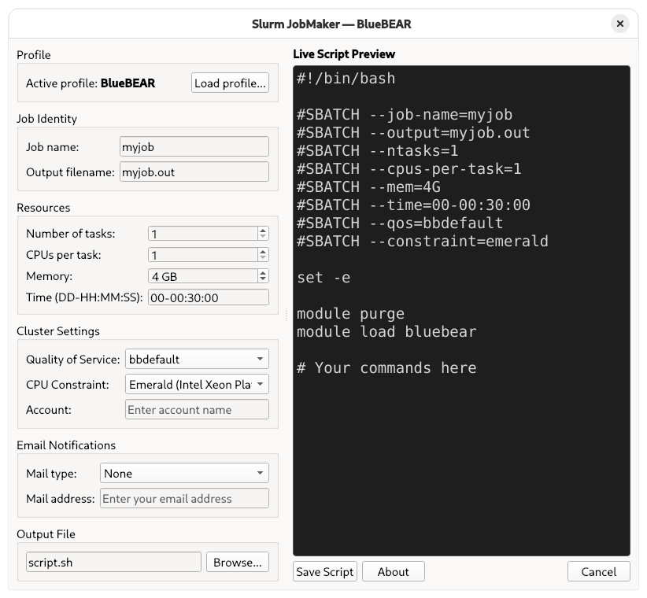

<p align="center">
  
</p>

# Slurm JobMaker

**An open-source graphical tool for generating Slurm job submission scripts for HPC environments**

[](https://doi.org/10.5281/zenodo.19629545)
[](LICENCE)

Slurm JobMaker is an open-source, portable graphical tool for the interactive
generation of Slurm job submission scripts. It guides early-stage researchers
and occasional HPC users through the configuration of key job parameters
interactively, displaying a live preview of the resulting script at all times.
It reduces configuration errors and lowers the barrier for accessing HPC systems
in academic research.

Cluster-specific settings — such as Quality of Service options, CPU constraints,
and environment preamble commands — are loaded from plain-text profile files,
making the tool adaptable to any Slurm-based HPC system without modification to
the source code, and readily usable across different institutions.

The tool is intended to run on the researcher's local machine. The recommended
workflow is to generate the job script locally and transfer it to the cluster
for submission using standard file transfer tools.

<p align="center">
  
</p>

**Author:** Vincenzo Brachetta, University of Birmingham (UK)  
**Contact:** v.brachetta@bham.ac.uk

---

## Features

- Interactive form for setting all common Slurm parameters
- Live script preview that updates as you type
- Profile-based configuration for different HPC clusters
- Load any profile from anywhere on the filesystem via file dialog
- Input validation before saving
- Save script to any location via file browser
- Developed and tested on Debian GNU/Linux 13.4 (Trixie) and tested on Fedora 43
  (via containerised environment)

---

## Requirements

### Running the pre-built packages
- Linux with a graphical desktop environment
- Dependencies are handled automatically by the package manager

### Building from source
- Linux with a graphical desktop environment
- Qt6 (`qt6-base-dev`)
- CMake 3.16 or later
- GCC or any C++17-compatible compiler

---

## Building from Source

Install dependencies (Debian):

    sudo apt install build-essential cmake qt6-base-dev

Clone the repository and build:

    git clone https://github.com/vbrachetta/slurm-jobmaker.git
    cd slurm-jobmaker
    chmod +x build.sh
    ./build.sh

The binary will be placed in `./build/SlurmJobMaker`.

---

## Packages

Pre-built packages for Debian (`.deb`) and Fedora/Rocky
Linux/Red Hat (`.rpm`) are available on the
[GitHub releases page](https://github.com/vbrachetta/slurm-jobmaker/releases).

### DEB Package (Debian)

Install:

    sudo apt install ./slurm-jobmaker_1.0.0_amd64.deb

Remove and purge configuration files:

    sudo apt purge slurm-jobmaker

#### Building the DEB package from source

The build script compiles the application, assembles the package directory
structure, and produces a ready-to-install `.deb` package.

Install the required tools:

    sudo apt install build-essential cmake qt6-base-dev rpm

Run from the project root:

    ./packaging/build_deb.sh

The package will be created in the project root as
`slurm-jobmaker_1.0.0_amd64.deb`.

### RPM Package (Fedora/Rocky Linux/Red Hat)

Install:

    sudo dnf install ./slurm-jobmaker-1.0.0-1.x86_64.rpm

Remove:

    sudo dnf remove slurm-jobmaker

#### Building the RPM package from source

The build script creates a source tarball from the Git repository, compiles the
application inside the `rpmbuild` environment, and produces a ready-to-install
`.rpm` package.

The RPM build uses `git archive` and therefore requires the project to be inside
a Git repository with at least one commit:

    git init
    git add .
    git commit -m "Initial commit"

Install the required tools:

    sudo apt install build-essential cmake qt6-base-dev rpm git

Run from the project root:

    ./packaging/rpm/build_rpm.sh

The package will be created in the project root as
`slurm-jobmaker-1.0.0-1.x86_64.rpm`.

---

## Usage

Launch from the application menu, or from the terminal:

    SlurmJobMaker

When building from source, run:

    ./build/SlurmJobMaker

No profile is loaded at startup. Click *Load profile...* to select a `.conf`
profile file from anywhere on your filesystem. Once loaded, the cluster-specific
settings are applied automatically and the live preview updates immediately.

---

## Profile Files

Profiles are plain-text `.conf` files that define cluster-specific settings.
They follow a simple INI-style format and can be edited by hand.

### Example profile (`profiles/bluebear.conf`)

    [Profile]
    name = BlueBEAR

    [QOS]
    options = bbdefault, bbshort, bbgpu

    [Constraints]
    options = :No constraint, emerald:Emerald (Intel Xeon Platinum 8570), sapphire:Sapphire Rapids (Intel Xeon Platinum 8480CL), icelake:Ice Lakes (Intel Xeon Platinum 8360Y)

    [Preamble]
    line1 = module purge
    line2 = module load bluebear

### Profile keys

| Section         | Key                    | Description                                                                                           |
|-----------------|------------------------|-------------------------------------------------------------------------------------------------------|
| `[Profile]`     | `name`                 | Display name shown in the window title and GUI                                                        |
| `[QOS]`         | `options`              | Comma-separated list of QOS values. Leave empty to omit the `--qos` directive                        |
| `[Constraints]` | `options`              | Comma-separated list of `key:Label` pairs. An empty key means no constraint is written to the script  |
| `[Preamble]`    | `line1`, `line2`,...  | Commands inserted into the script before user commands, one per key                                   |

To create a profile for a different cluster, copy `profiles/generic.conf`,
rename it, and edit the values to match your system.

---

## Cross-Distribution Testing with Podman

Cross-distribution compatibility has been verified by running the application
inside a Fedora 43 container using Podman on a Debian 13 host. Both the
container and the Fedora image are automatically removed after each test
session, leaving no trace on the host system.

### Host environment

| Component      | Version                        |
|----------------|--------------------------------|
| Host OS        | Debian GNU/Linux 13.4 (Trixie) |
| Podman         | 5.4.2                          |
| Container image| Fedora 43                      |
| Display        | Wayland with XWayland support  |

### Install Podman on Debian

    sudo apt install podman

### Testing the binary directly

Place the compiled `SlurmJobMaker` binary in the `packaging/testing/` directory, then
run:

    cd packaging/testing
    ./run-fedora-gui.sh

This script installs the required Qt6 runtime dependencies inside the
container and launches the application.

### Testing the RPM package

Place the `.rpm` file in the `packaging/testing/` directory as
`SlurmJobMaker.rpm`, then run:

    cd packaging/testing
    ./run-fedora-rpm-gui.sh

This script installs the RPM package inside the container and launches the
application. Both scripts forward the host display socket into the container and
revoke access on exit.

---

## Project Structure

    slurm-jobmaker/
    ├── main.cpp                    # Application source code
    ├── CMakeLists.txt              # Build configuration
    ├── build.sh                    # Convenience build script
    ├── profiles/
    │   ├── bluebear.conf           # Profile for BlueBEAR (University of Birmingham)
    │   └── generic.conf            # Minimal generic profile
    ├── assets/
    │   ├── screenshot.png               # Application screenshot
    │   ├── slurm-jobmaker.svg           # Application logo
    │   ├── src/
    │   │   └── slurm-jobmaker.svg       # Application logo source file
    │   └── icons/
    │       ├── 16x16/slurm-jobmaker.png
    │       ├── 32x32/slurm-jobmaker.png
    │       ├── 48x48/slurm-jobmaker.png
    │       ├── 128x128/slurm-jobmaker.png
    │       └── 256x256/slurm-jobmaker.png
    ├── packaging/
    │   ├── build_deb.sh                 # DEB package build script
    │   ├── build_rpm.sh                 # RPM package build script
    │   ├── debian/                      # DEB packaging files
    │   │   ├── control                  # Package metadata and dependencies
    │   │   ├── changelog                # Debian package changelog
    │   │   ├── copyright                # Licence and copyright information
    │   │   └── rules                    # Build rules
    │   ├── rpm/
    │   │   └── slurm-jobmaker.spec      # RPM spec file
    │   └── testing/
    │       ├── run-fedora-gui.sh        # Fedora container binary test
    │       └── run-fedora-rpm-gui.sh    # Fedora container RPM test
    ├── LICENCE                     # MIT Licence
    ├── CHANGELOG.md                # Version history
    ├── CITATION.cff                # Machine-readable citation metadata
    └── README.md                   # This file

---

## Licence

This project is distributed under the [MIT Licence](LICENCE).
You are free to use, modify, and distribute it, provided the original
copyright notice is retained.

---

## Citation

If you use this software in your research, please cite it as follows:

> Brachetta, V. (2026). *Slurm JobMaker* (Version 1.0.0). Zenodo.
> https://doi.org/10.5281/zenodo.19629545

A BibTeX entry is provided below for convenience:
```bibtex
    @software{brachetta2026slurmjobmaker,
      author    = {Brachetta, Vincenzo},
      title     = {Slurm JobMaker},
      year      = {2026},
      version   = {1.0.0},
      publisher = {Zenodo},
      doi       = {10.5281/zenodo.19629545},
      url       = {https://github.com/vbrachetta/slurm-jobmaker}
    }
```
---

## Acknowledgements

The author thanks Prof. Mayorkinos Papaelias for his time and support. The
Birmingham Environment for Academic Research (BEAR) is gratefully acknowledged
for maintaining the BlueBEAR HPC facility, and in particular the Researcher
Engagement & Data Group. The software and documentation were developed by the
author with assistance from large language models made available by the IT
Innovation Centre at the University of Birmingham, which the author also
gratefully acknowledges. All outputs have been reviewed and validated for
accuracy.
